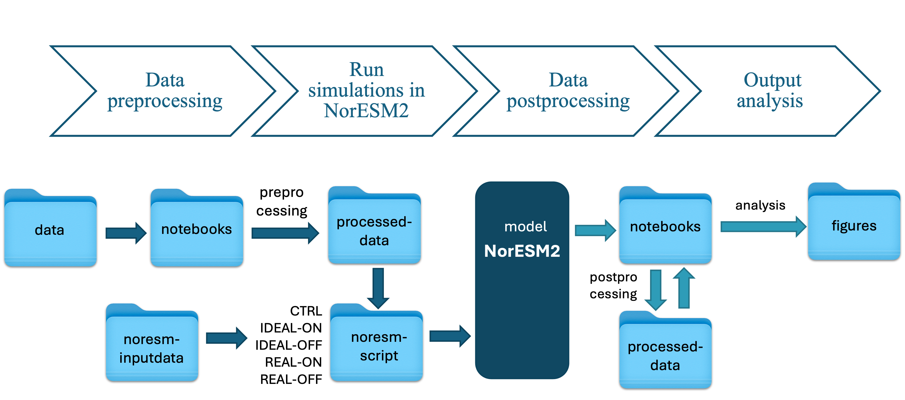

 
 <h1 align="center">  What if Greenland was green? - exploring the climate feedbacks initiated by natural vegetation adaptation in the boreal zone </h1>  
 
This is my master thesis work, supervised by [Terje Koren Berntsen](https://www.mn.uio.no/geo/english/people/aca/metos/terjebe/), [Sara Marie Blichner](https://github.com/sarambl), [Trude Storevlmo](https://www.mn.uio.no/geo/english/people/aca/metos/truds/index.html), at the [UiO - University of Oslo](https://www.uio.no/english/).

🚧 *It is a WIP project* 🚧

## Brief description
The thesis work explores the response in the atmosphere-land interactions to an expected northward vegetation shift due to climate change. Plants are expected to move to higher latitude and altitude in response to the raising temperature. This vegetation response has itself effects to the climate, initiating climatic feedbacks that lead to an overall nonlinear response of the Earth system to the initial temperature change. One of these feedbacks is the so-called vegetation-BVOC-cloud feedback, that deals with a change in atmospheric composition, presence and distribution of aerosols, formation and duration of clouds. The focus will be on the boreal zone and the dynamic is invastigated with the Norwegian Earth System Model v2 (NorESM2).

## Abstract

A poleward migration of vegetation is expected in response to the rising surface temperatures
with important implications in the boreal zone and the Arctic. This shift is proposed to have
important impacts on the climate, initiating both positive and negative feedback mechanisms.
One of those is the vegetation-BVOC-cloud feedback. It acts through increased emissions
of biogenic volatile organic compounds (BVOCs), which are expected to rise the number
concentration of particles in the atmosphere and thus influence the cloud properties by
increasing their reflectivity and cooling the climate. In this thesis, the Norwegian Earth System
Model v2 (NorESM2) was used to investigate the climatic responses of a vegetation shift in
the boreal zone, while focusing on understanding and quantifying the processes involved in
the vegetation-BVOC-cloud feedback. The experiment was set up with imposed vegetation
shift in latitudes above 50°N, present-day climate, and fixed sea surface temperature. Three
sets of simulations were run with (a) unperturbed vegetation, (b) a forced idealized shift,
and (c) a semi-realistic vegetation change, based on data from the dynamic vegetation model
LPJ-GUESS. For each of the last two sets, two simulations were run with identical setups,
except for BVOC emissions. One allowed the BVOC emissions to interactively respond to the
perturbed vegetation, while for the other the emissions were fixed at the present-day vegetation
distribution. Comparisons between simulations highlight the impacts due to the vegetation
shift, while isolating the BVOC emission-related effects on aerosol and cloud properties as well
as quantifying the overall forcing on the global radiative balance.
The findings show that the expected vegetation migration in the northern latitudes can have a
significant impact on a global scale. It results in a positive radiative forcing - as average over
50°N - of +0.13 W/m2 and +0.43 W/m2 for respectively the idealized and the semi-realistic
perturbations, and the change in surface albedo dominates the forcing. As needle-leaved trees
expand over shrubs and grass, their darker canopies impact on lowering the reflectivity of the
surface (i.e. albedo), particularly in spring when the sunlight reaches the northern latitudes
and the tree-free areas are covered by the snow. Surprising results are found regarding the
BVOC emission-related impacts. Their contribution to the total net forcing is quantified in
a positive effect of +0.02 W/m2 and +0.01 W/m2. Even if the signal is small, it is in the
opposite direction of the expected change, thus not having a cooling but a slightly warming
effect on climate.This is consistent with the observed decrease in aerosol and cloud droplet
number concentrations (respectively -0.30% and -0.93% for the idealized case, -0.18% and
-1.00% for the realistic case), since they affect the cloud albedo by lowering it and the cloud
radiative effect by increasing it. The BVOC-related response in cloud radiative forcing is +0.05
W/m2 in both the idealized and realistic change, thus confirming the warming effect of an
increase in BVOC emission (quantified approximately in a range between +2% and +7%).
Evidence on changes in aerosol and cloud properties suggests that the BVOC emission change
could enhance aerosol loss processes, such as precipitation. Nevertheless, it is still unclear
which are the processes involved, as the response becomes noisier and the signal hard to be
traced throughout the steps of these dynamics, in particular when it comes to aerosol-cloud
interactions. Further investigations are important for a better understanding of these processes
and their impacts in a changing climate.

## Repo organisation
- `data`*: original land surface file and vegetation data from LPJ-GUESS ([Tang et al. (2021)](https://www.researchsquare.com/article/rs-1143422/v1)).
- `noresm-inputdata`*: input files to run [NorESM2](https://github.com/NorESMhub/NorESM).
- `noresm-scripts`: scripts and other files used to run simulations in [NorESM2](https://github.com/NorESMhub/NorESM).
- `notebooks`** : jupyter notebooks and python scripts to process, analyse and visualize input and output data
- `processed-data`*: data after pre- and post-processing
- `figures`: vegetation maps and results
- `training`: some scripts to learn and train how to analyse model data
- `img`: imported images

 *\*data is not uploaded on the GitHub repository for storage capacity*
 
 *\**notebooks analysing LPJGUESS data are not imported for confidential content*

 

## Simulation plan
Two set of experiments is performed to investigate this response. First, the input vegetation was modified with an idealized shift of vegetation, where 50% of grass was replaced by shrubs, and so shrubs by trees, while the second set had a semi-realistic change given by the data of the Dynamic Global Vegetation Model (DGVM) LPJ-GUESS from the study of [Tang et al. (2021)](https://www.researchsquare.com/article/rs-1143422/v1). Each set had a first spin-up simulation to make variables reach the steady-state and a couple of primary simulations, with respectively interactive and fixed BVOC emissions, in order to discern the response liked to the feedback loop from the albedo and evatranspiration effect. To have the BVOC emissions to control the feedback, another set of simulations is perfomed, with present day conditions and no vegetation shift. A schematic simulation setup is represented in the following figure:

 
 

The specifications to run each simulation can be found in the folder `noresm-scripts\cases-scripts`.

## Contributing

🚧 Any contribution is welcome! Please open [pull requests](https://github.com/adelezaini/master-thesis/pulls) or use the [issue tracker](https://github.com/adelezaini/master-thesis/issues) to report, comment and suggest.

## License

📋 The code is released under the terms of the [MIT Licence](https://opensource.org/licenses/MIT). See the file [LICENSE.md](https://github.com/adelezaini/master-thesis/blob/master/LICENSE).
