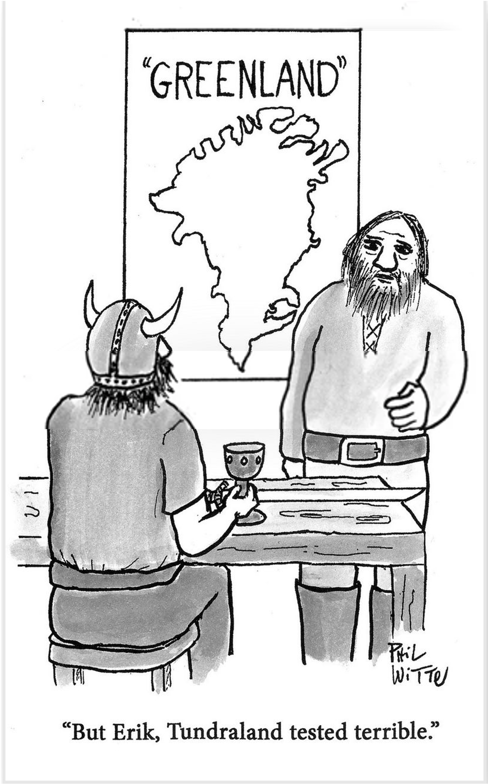

 
 <h1 align="center">  What if Greenland was green? - exploring the climate feedbacks initiated by natural vegetation adaptation in the boreal zone </h1>  
 
This is my master thesis work, supervised by [Terje Koren Berntsen](https://www.mn.uio.no/geo/english/people/aca/metos/terjebe/), [Sara Marie Blichner](https://github.com/sarambl), [Trude Storevlmo](https://www.mn.uio.no/geo/english/people/aca/metos/truds/index.html), at the [UiO - University of Oslo](https://www.uio.no/english/).

🚧 *It is a WIP project* 🚧

## Brief description
The thesis work explores the response in the atmosphere-land interactions to an expected northward vegetation shift due to climate change. Plants are expected to move to higher latitude and altitude in response to the raising temperature. This vegetation response has itself effects to the climate, initiating climatic feedbacks that lead to an overall nonlinear response of the Earth system to the initial temperature change. One of these feedbacks is the so-called vegetation-BVOC-cloud feedback, that deals with a change in atmospheric composition, presence and distribution of aerosols, formation and duration of clouds. The focus will be on the boreal zone and the dynamic is invastigated with the Norwegian Earth System Model v2 (NorESM2).

## Repo organisation
- `noresm-inputdata`*: input files to run [NorESM2](https://github.com/NorESMhub/NorESM).
- `data`**: input data from LPJ-GUESS ([Tang et al. (2021)](https://www.researchsquare.com/article/rs-1143422/v1)).
- `noresm-scripts`: scripts and other files used to run simulations in [NorESM2](https://github.com/NorESMhub/NorESM).
- `notebooks`** : jupyter notebooks and .py files to analyse and process input and output data
- `processed-data`*: output files after some analysis
- `figures`: output figures
- `training`: some scripts to learn and train how to analyse model data
- `img`: imported images

 *\*data is not uploaded on the GitHub repository for storage capacity*
 
 *\**notebooks analysing LPJGUESS data are not imported for confidential content*

 

## Simulation plan
Two set of experiments is performed to investigate this response. First, the input vegetation was modified with an idealized shift of vegetation, where 50% of grass was replaced by shrubs, and so shrubs by trees, while the second set had a semi-realistic change given by the data of the Dynamic Global Vegetation Model (DGVM) LPJ-GUESS from the study of [Tang et al. (2021)](https://www.researchsquare.com/article/rs-1143422/v1). Each set had a first spin-up simulation to make variables reach the steady-state and a couple of primary simulations, with respectively interactive and fixed BVOC emissions, in order to discern the response liked to the feedback loop from the albedo and evatranspiration effect. To have the BVOC emissions to control the feedback, another set of simulations is perfomed, with present day conditions and no vegetation shift. A schematic simulation setup is represented in the following figure:

 
 

The specifications to run each simulation can be found in the folder `noresm-scripts\cases-scripts`.

## Contributing

🚧 Any contribution is welcome! Please open [pull requests](https://github.com/adelezaini/master-thesis/pulls) or use the [issue tracker](https://github.com/adelezaini/master-thesis/issues) to report, comment and suggest.

## License

📋 The code is released under the terms of the [MIT Licence](https://opensource.org/licenses/MIT). See the file [LICENSE.md](https://github.com/adelezaini/master-thesis/blob/master/LICENSE).
